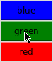

# XCOLORV

Convert from '#RRGGBB' representation to it's nearest X11 name.

## Prerequisites

- Tcl/Tk
- X11 libraries
- GNU/Make (installation)

## Installing

    $ make install

## Example

    $ xcolorv -x 0000ff 00ff00 ff0000

    $ xcolorv -n 0000ff 00ff00 ff0000
    blue
    green
    red

## Help

xcolorv

    Usage: xcolorv OPTIONS... #RRGGBB|plan9
    
    Convert from '#RRGGBB' representation to it's nearest X11 name.
    
        -l : List defined X colors.
        -n : Get the color name.
        -x : View specified colors.
    
    Bug reports, feature requests to gemini|https://harkadev.com/oss
    Copyright (c) 2022 Harkaitz Agirre, harkaitz.aguirre@gmail.com

## Collaborating

For making bug reports, feature requests and donations visit
one of the following links:

1. [gemini://harkadev.com/oss/](gemini://harkadev.com/oss/)
2. [https://harkadev.com/oss/](https://harkadev.com/oss/)

